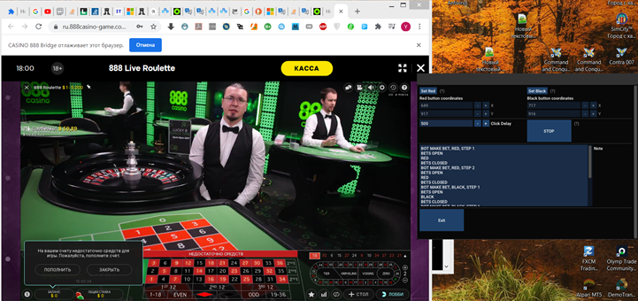

# 888casino-game-bot
Робот для автоматической игры на 888casino

### Описание

Архив *bin/casino888-bot.zip* содержит робота-кликера для живой европейской рулетки. Робот кликер реализует следующую стратегию:

* 1 смотрим какой цвет только что был или зеро. Если зеро, пропуск 6-20 спинов рандомно.
* 2 в зависимости от цвета, что выпало, красный, черный, зеро ставим на такой же цвет что и предыдущий мин ставку. Если зеро, запоминаем, какая была предыдущая ставка, пропускаем рандомно от 6 до 20 пустых спинов и продолжаем по алгоритму. (красный 0.1)
* 3 если после пункта 2 получился выигрыш, то ставка та же на тот же цвет. Если получился проигрыш, то ставим на противоположный и удваиваем (красный, выигрыш 0.1 ставка  на красный 0.1). ( черный проигрыш, ставка на черный 0.2) (зеро проирали.) Если зеро, запоминаем сумму ставки перед зеро, пропускаем рандомно от 6 до 20 пустых спинов, потом смотрим, чтобы выпало минимум 2 любых цвета подряд, как нашли это триггер к ожиданию смены цвета и на следующий, после смены, с удвоенным объемом делаем ставку
* 4 если пункт 3 повторился четыре раза подряд, черное, красное, черное. На 5 раз ставка не делается, пропускаем рандомно от 6 до 20 пустых спинов, потом смотрим, чтобы выпало минимум 2 любых цвета подряд, как нашли это триггер к ожиданию смены цвета и на следующий, после смены, с удвоенным объемом делаем ставку.

Каждому шагу мартингейла робота соответствует определенное количесвто нажатий роботом на черное или красное (одна ставка, две ставки и т.д.)

Робот берет данные о результате ставки, а также состояния игры (начало приема ставок, завершение пр.) при помощи специального расширения для браузера Chrome. Найти расширение можно тут *extensions/casino888-bridge.zip*.

Расширение использует API отладки браузера, чтобы перехватывать соединение по *websocket*. Из сообщений *websocket'a* расширение парсит всю необходимую информацию и пересылает роботу-кликету на локальный *websocket-сервер*.

Чтобы установить расширение, включите в браузере режим разработчика и выберите папку *casino888-bridge* с расширением.

### Как настроить и запустить бота

1. Установите расширение *casino888-bridge* в браузере.
2. Зайдите на страницу 888casino и выберите живую игру с ервопейской рулеткой.
3. Выключите в настройках игры автоматическую подстройку качества видеопотока, чтобы в случае ухудшения интернет связи оконо для ставок не меняло свои размеры и позиции.
3. После удачной загрузки страницы и отключения автоматической настройкаи качества видеопотока, запустите программу бота.
4. Нажмите в программе бота кнопку *set red*, перенесите мышку на красный ромбик для ставки  нажмите *S*, программа сохранит координату клика для ставки на красное.
5. Аналогично проделайте и для ставки на черное, нажмите на *set_black* и проделайте те же самые операции.
6. Уажите время задержки между кликами. По умолчанию в программе стоит 500 мс.
7. Нажмите кнопку Start. Робот начнет делать ставки в соответствии со стратегией.
8. Для завершения работы программы нажмите Stop или Exit.

### Пример работы робота

### Как собрать робота

* Папка *lib* содержит все зависимости как субмодули или архивы. 
* Папка *include* содержит *.hpp* файлы со стратегией и сервером.
* Сам робот находится в папке *code_blocks/casino-bot* и был разработан в среде *Code::Blocks*.
*Проект для *Code::Blocks* использует настройки компилятора, которые отсутсвуют на вашем рабочем ПК. Поэтому перед сборкой не забудьте указать или установить компилятор. Для сборки проекта был использован компилятор *mingw-7.3.0* для *x64*, конкретное название *x86_64-7.3.0-release-posix-seh-rt_v5-rev0*.

